# 经济金融 AI 智能体设计课程平台

多租户课程作业管理平台 — 教师发布作业，学生在线提交，AI 双 Agent 并行评审产出结构化反馈。内置 AI 助教、学习资源管理、课程分享投票、数据库备份。

---

## 目录

- [快速开始](#快速开始)
- [功能总览](#功能总览)
  - [超级管理员端](#超级管理员端)
  - [教师端](#教师端)
  - [学生端](#学生端)
- [界面展示](#界面展示)
  - [登录与注册](#登录与注册)
  - [超级管理员](#超级管理员)
  - [教师端界面](#教师端界面)
  - [学生端界面](#学生端界面)
- [技术栈](#技术栈)
- [环境变量](#环境变量)

---

## 快速开始

### 1. 配置环境变量

```bash
cp .env.example .env
# 编辑 .env，填写数据库密码、JWT 密钥、AI 模型 API Key 等
```

### 2. 启动基础设施

```bash
docker compose up -d   # PostgreSQL + MinIO
```

### 3. 启动后端

```bash
cd backend
pip install -r requirements.txt
uvicorn main:app --reload --port 25002
```

首次启动自动执行数据库迁移并创建超级管理员账号。

### 4. 启动前端（开发）

```bash
cd my-app
npm install && npm run dev
```

### 5. 生产构建

```bash
cd my-app && npm run build
# 输出到 backend/dist/，后端同时提供 API 和前端页面
```

> **下一步更新**：前后端打包进 Docker 容器，一键部署。

---

## 功能总览

### 超级管理员端

| 功能模块 | 功能说明 |
|---------|---------|
| 邀请码管理 | 创建邀请码并分发给教师用于注册，支持重新生成（旧码立即失效）和删除 |
| 教师管理 | 查看所有教师账号及其班级数量，支持启用/禁用、重置密码、删除教师 |

### 教师端

| 功能模块 | 功能说明 |
|---------|---------|
| 班级管理 | 创建班级、查看加入凭证（支持复制和重新生成）、删除班级 |
| 学生名单 | 添加/批量导入预期学号，查看已注册学生，审批学生密码重置申请 |
| 作业列表 | 查看当前班级所有已发布作业，显示提交人数和提交率进度条 |
| 创建作业 | 填写标题、说明、评分标准（支持 AI 生成），添加学习资源，保存草稿或直接发布 |
| 作业详情 | 查看作业内容和统计数据（总人数/已提交/提交率），逐个查看学生提交和 AI 批改结果 |
| AI 助教 | Agent Loop 架构的智能助手，支持 12 个工具（查询班级数据、管理作业、搜索资料等）和 2 个技能（作业设计、成绩分析） |
| 分享管理 | 创建分享主题供学生投票，确认主题后排期，记录分享材料（Markdown） |
| 模型管理 | 添加和管理 AI 模型配置（API Key、Base URL、适配器类型），激活用于批改的模型 |
| 数据备份 | 一键备份数据库到 MinIO 对象存储，支持下载、重命名、恢复、删除 |

### 学生端

| 功能模块 | 功能说明 |
|---------|---------|
| 任务列表 | 查看当前班级所有已发布作业，显示提交状态（未提交/已完成） |
| 作业详情 | 查看作业说明、评分标准和学习资源，通过文本粘贴/文件上传/图片上传提交作业 |
| AI 批改反馈 | 双 Agent 并行评审（标准审查 + 亮点发现），产出结构化反馈：分数、维度得分进度条、总评、改进建议、亮点 |
| 我的成绩 | 成绩汇总表，显示每个作业的最新提交状态、版本数和分数（颜色分级） |
| 课程分享 | 查看分享主题并投票（每人 3 票），查看已完成分享的材料 |
| 加入班级 | 通过教师提供的加入凭证加入班级 |
| 切换班级 | 在已加入的多个班级之间切换 |
| 修改密码 | 自助修改密码（最多 3 次），超出后需向教师申请重置 |

---

## 界面展示

### 登录与注册

书院风设计，墨蓝底色搭配宣纸色调。支持学生注册和教师注册（需邀请码）。

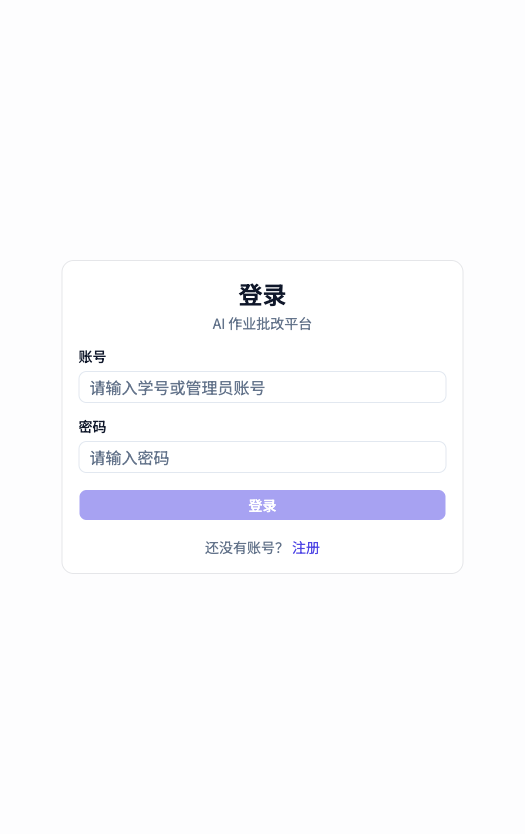

### 超级管理员

管理教师账号和邀请码，控制教师的启用/禁用状态。

**教师管理**

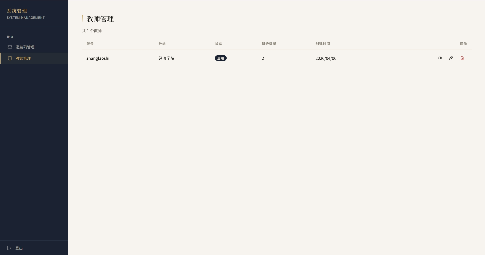

**邀请码管理**

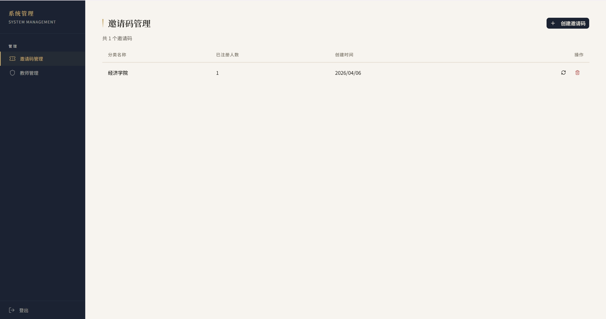

### 教师端界面

**班级管理**

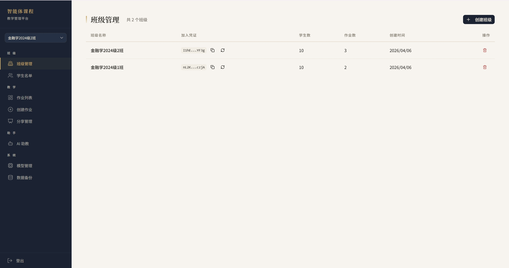

**学生名单**

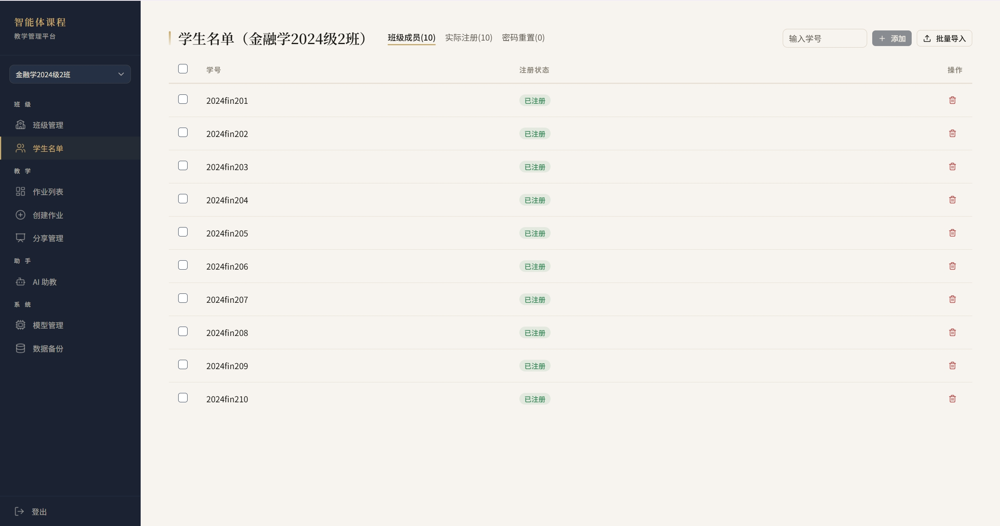

**作业列表**

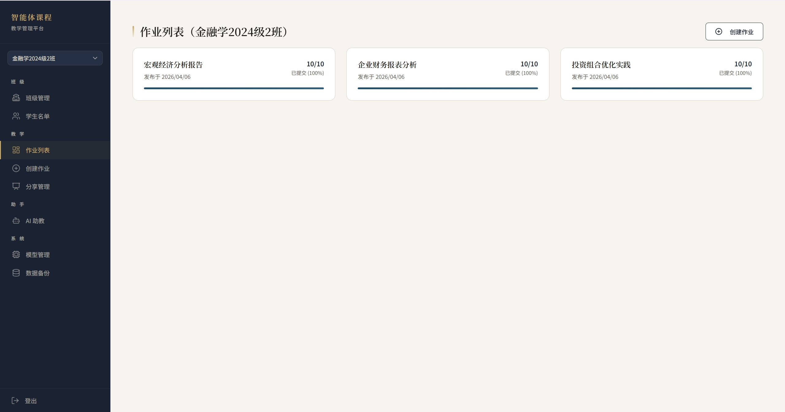

**创建作业**

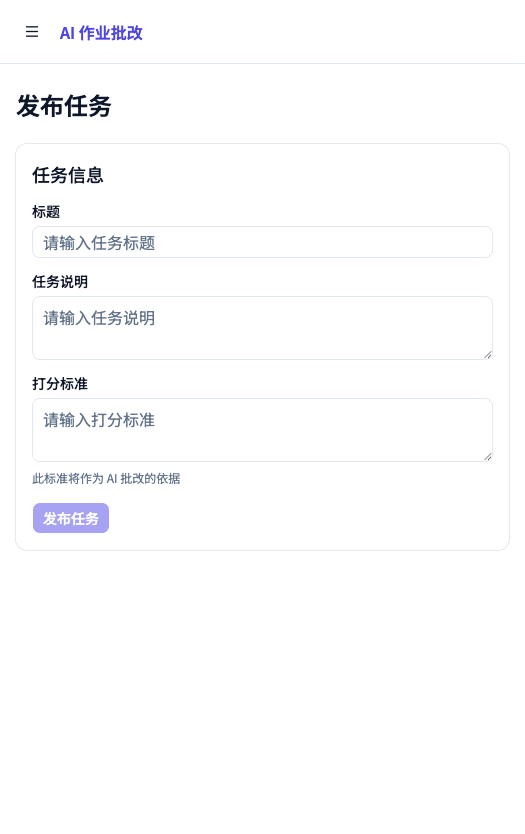

**AI 助教** — 支持自然语言交互，自动调用工具查询班级数据、设计作业、分析成绩。搜索结果自动沉淀为作业的学习资源。

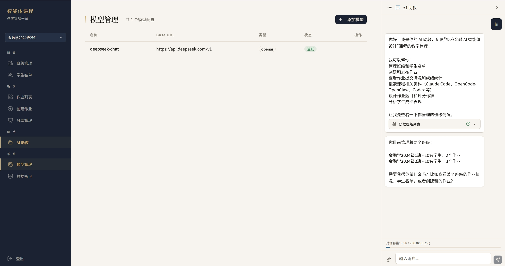

### 学生端界面

**任务列表**

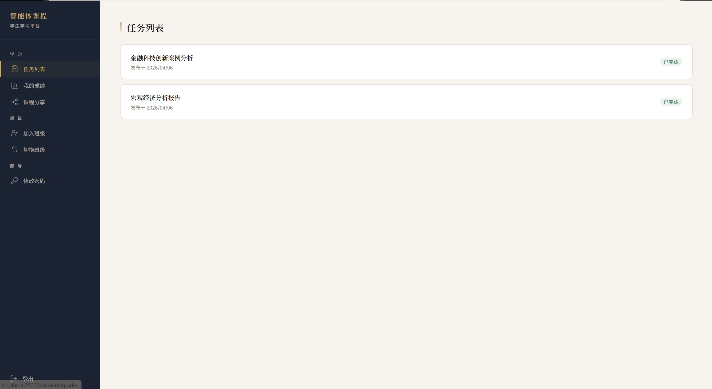

**我的成绩**

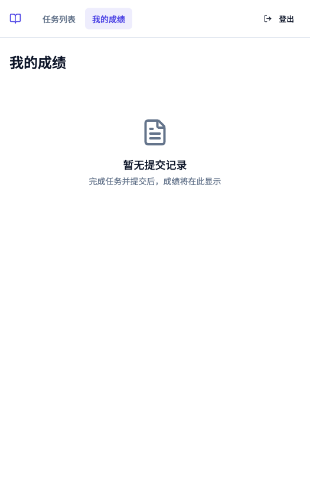

**作业详情** — 查看作业要求和学习资源，通过文本粘贴/文件上传/图片上传提交作业。

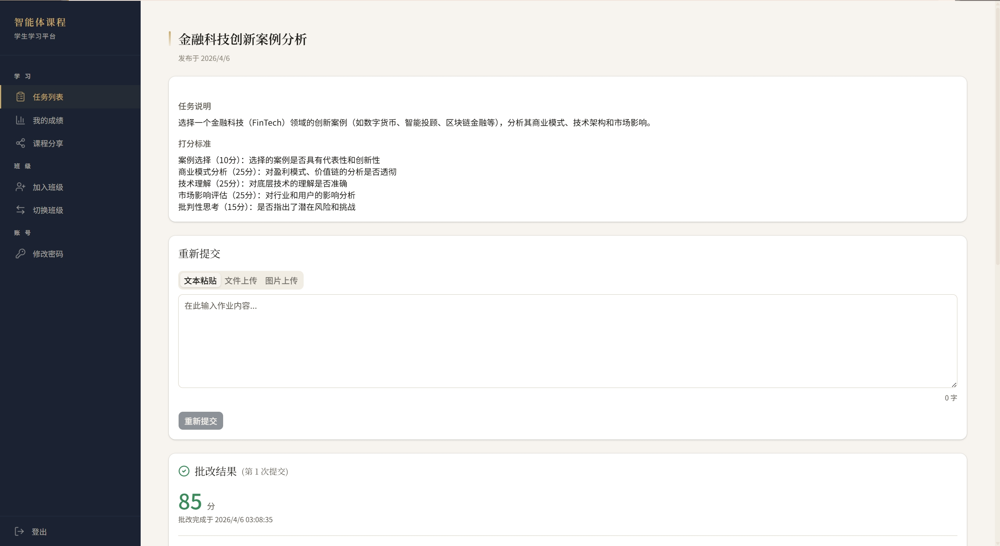

**AI 批改反馈** — 双 Agent 并行评审，产出结构化反馈：维度得分、总评、改进建议、亮点。

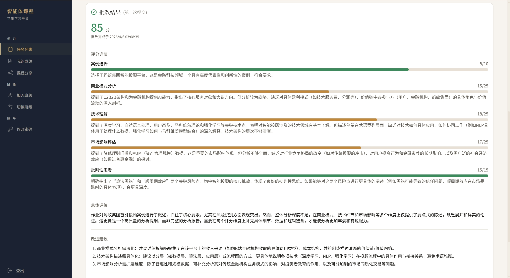

**加入班级**

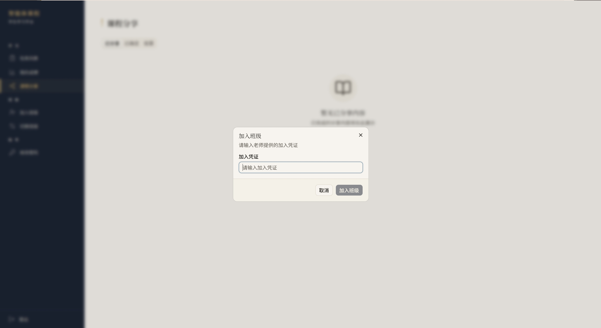

**切换班级**

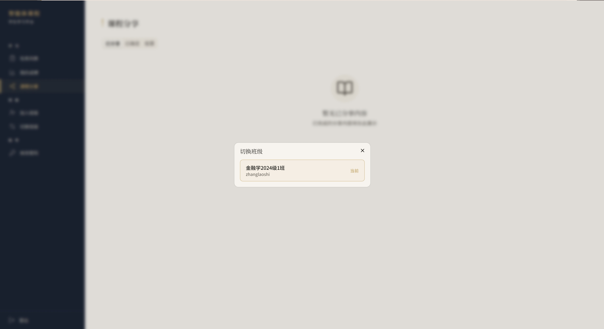

---

## 技术栈

| 层 | 技术 |
|---|---|
| 后端 | FastAPI + SQLAlchemy Async + PostgreSQL 17 |
| 对象存储 | MinIO（文件上传 + 数据库备份） |
| 基础设施 | Docker Compose（PostgreSQL + MinIO） |
| 前端 | React 19 + TypeScript + Vite 8 + shadcn/ui + Tailwind CSS 4 |
| AI 批改 | 双 Agent 并行评审（标准审查 + 亮点发现），OpenAI / Anthropic 适配器 |
| AI 助教 | Agent Loop + 12 工具 + 2 技能 + Tavily 搜索 |
| 数据库迁移 | Alembic |

---

## 环境变量

所有配置集中在 `.env` 文件中，参考 `.env.example`：

| 变量 | 默认值 | 说明 |
|---|---|---|
| `PORT` | `25002` | 后端监听端口 |
| `SECRET_KEY` | *(需修改)* | JWT 签名密钥 |
| `DB_HOST` / `DB_PORT` | `localhost` / `25001` | PostgreSQL 地址 |
| `POSTGRES_USER` / `POSTGRES_PASSWORD` / `POSTGRES_DB` | `postgres` / `postgres` / `homework` | PostgreSQL 认证 |
| `MINIO_ENDPOINT` | `localhost:25003` | MinIO API 地址 |
| `MINIO_ROOT_USER` / `MINIO_ROOT_PASSWORD` | `minioadmin` / `minioadmin` | MinIO 认证 |
| `DEFAULT_ADMIN_ID` / `DEFAULT_ADMIN_PASSWORD` | `admin` / `changeme` | 首次启动创建的超级管理员 |
| `TAVILY_API_KEY` | *(空)* | Tavily 搜索 API Key |
