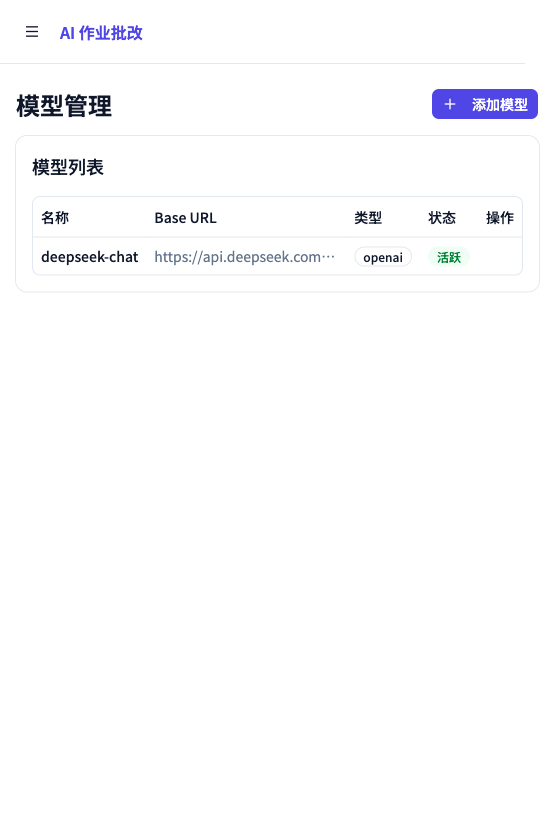
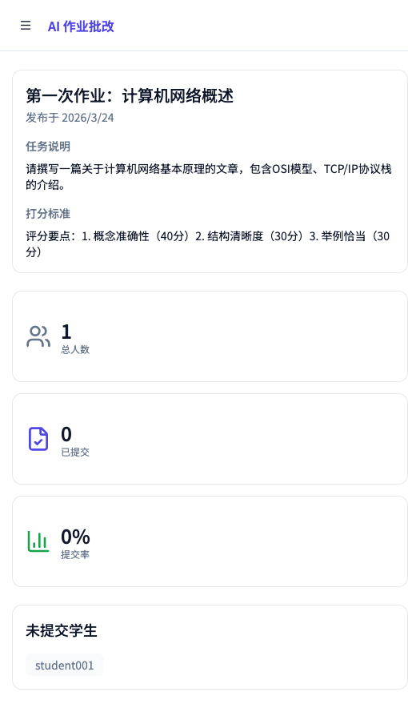
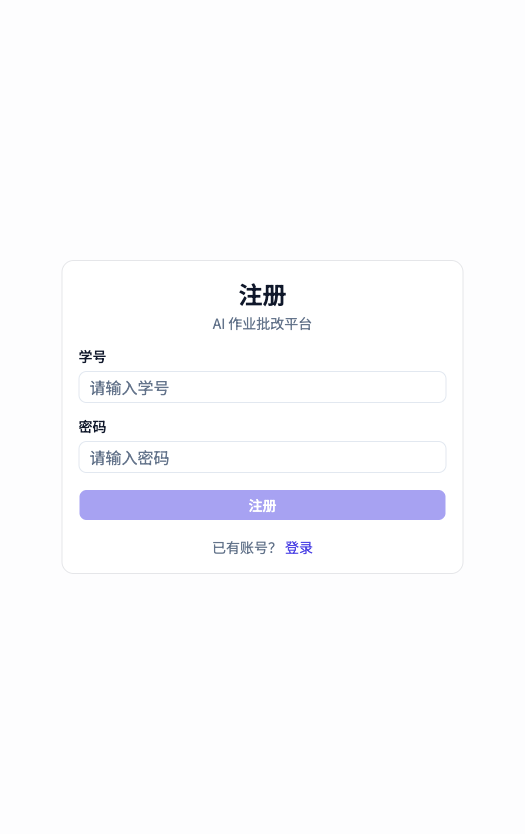

# 🤖 经济金融AI智能体设计课程平台

岭南学院课程作业平台：教师发布任务与评分标准，学生在线提交 `.md` / `.txt` 作业，系统调用可配置的大模型进行异步批改，并向教师和学生分别展示提交状态、成绩与评语。

## ✨ 项目概览

- **后端**：FastAPI + SQLAlchemy + SQLite
- **前端**：Vite + React 19 + TypeScript + React Router
- **批改方式**：后台异步任务调用 OpenAI / Anthropic 兼容模型，Prompt 内置注入检测与安全隔离
- **评分标准生成**：基于 ReAct 架构 + Tavily 搜索，AI 自动生成结构化评分标准
- **任务暂存**：支持草稿 → 发布的两阶段工作流，草稿对学生不可见
- **用户角色**：管理员、学生
- **数据存储**：
  - 业务数据默认保存在 `backend/data.db`
  - 学生提交文件默认保存在 `backend/storage/submissions/`
  - 前端生产构建输出到 `backend/dist/`，由 FastAPI 统一托管

## 👩‍🏫 教师（管理员）使用指南

管理员账号在系统初始化时自动创建，账号密码由 `.env` 中的 `DEFAULT_ADMIN_ID` / `DEFAULT_ADMIN_PASSWORD` 决定，**无需注册，直接登录**。

### 第一步：登录

访问 `/login`，输入管理员账号和密码，系统自动跳转到管理仪表板。

| 登录页 | 管理仪表板 |
|--------|-----------|
|  |  |

### 第二步：维护学号名单

进入「学号名单」页，添加允许注册的学生学号（支持逐个添加或批量导入）。**只有在名单中的学号才能注册账号。**


### 第三步：创建与发布作业任务

进入「草稿管理」页，点击「新建草稿」创建任务。任务创建后处于草稿状态，可在 Sheet 抽屉编辑器中逐步完善标题、任务说明和打分标准。

- **AI 生成打分标准**：填写标题和说明后，点击「AI 生成」按钮，系统使用当前激活模型 + Tavily 搜索自动生成结构化评分标准（维度 + 分值表格），管理员可在此基础上编辑
- **打分标准编辑器**：支持 Markdown 语法，提供编辑/预览/分屏三种模式
- **发布**：三个字段都填写完成后，点击「发布」将任务变为正式任务，对学生可见。已发布任务不可编辑或回退


### 第四步：配置 AI 批改模型

进入「模型管理」页，添加模型配置（支持 OpenAI 兼容接口和 Anthropic）并激活。



### 第五步：查看提交与批改结果

在仪表板点击任务卡片，可查看提交率统计、已提交/未提交学生列表及每位学生的 AI 评分结果。



---

## 🎓 学生使用指南

### 第一步：注册账号

访问 `/register`，输入学号和密码。**学号必须已被老师添加到名单中，否则注册会失败。**

| 注册页 | 登录页 |
|--------|--------|
|  |  |

### 第二步：查看任务并提交作业

登录后进入任务列表，点击任务查看详情，上传 `.md` 或 `.txt` 格式的作业文件后提交。每个任务只能提交一次。

| 任务列表 | 任务详情与提交 |
|----------|--------------|
|  |  |

### 第三步：查看成绩

进入「我的成绩」页查看所有任务的批改状态和分数。状态流转：`pending` → `grading` → `completed`（或 `failed`）。批改完成后可查看分数和 AI 评语。


## 🏗️ 架构与职责

### 后端 `backend/`

- `main.py`
  - 应用入口
  - 启动时创建提交目录并初始化数据库
  - 挂载 `backend/dist/` 作为前端静态资源
- `init_db.py`
  - 自动建表
  - 自动创建默认管理员
  - 自动插入默认模型配置
- `routers/`
  - `auth.py`：注册、登录
  - `roster.py`：管理员维护学号名单
  - `tasks.py`：任务 CRUD（含草稿管理、发布）、统计、AI 生成评分标准
  - `submissions.py`：学生提交、个人记录、管理员查看学生记录
  - `model_config.py`：模型新增与激活
- `services/grading_service.py`
  - 后台批改主流程
  - 读取作业文件、加载当前激活模型、生成评分结果并回写数据库
- `services/criteria_generator.py`
  - ReAct 循环驱动的评分标准生成
  - 使用活跃模型 + Tavily 搜索，输出结构化评分标准
- `services/ai/`
  - `base.py`：适配器基类、共享 Prompt 模板、`chat` 方法（支持 tool calling）
  - `openai_adapter.py`：OpenAI 兼容接口（grade + chat）
  - `anthropic_adapter.py`：Anthropic 接口（grade + chat）
  - `__init__.py`：`get_adapter` 工厂函数
- `auth/`
  - JWT 生成与鉴权依赖

### 前端 `my-app/`

- `src/App.tsx`
  - 定义公开路由、学生路由、管理员路由
- `src/contexts/AuthContext.tsx`
  - 保存 token、角色、用户 ID
  - 自动处理 token 过期
- `src/pages/student/`
  - `TaskListPage.tsx`：任务列表
  - `TaskDetailPage.tsx`：任务详情、上传作业、查看批改结果
  - `GradesPage.tsx`：成绩汇总
- `src/pages/admin/`
  - `DashboardPage.tsx`：任务概览与提交率（仅展示已发布任务）
  - `CreateTaskPage.tsx`：草稿管理（卡片网格 + Sheet 编辑器 + AI 生成 + 发布）
  - `TaskDetailPage.tsx`：单任务统计
  - `RosterPage.tsx`：学号名单维护
  - `StudentDetailPage.tsx`：单个学生的提交历史
  - `ModelsPage.tsx`：模型配置与激活
- `vite.config.ts`
  - 开发环境把 `/api` 代理到 `http://localhost:8000`
  - 构建产物输出到 `../backend/dist`

## 📁 目录结构

```text
book-web/
├── backend/
│   ├── auth/
│   ├── models/
│   ├── routers/
│   ├── schemas/
│   ├── services/
│   │   ├── ai/                    # 适配器 + 共享 Prompt + chat 方法
│   │   ├── criteria_generator.py  # ReAct + Tavily 评分标准生成
│   │   └── grading_service.py     # 异步批改调度
│   ├── config.py
│   ├── database.py
│   ├── init_db.py
│   ├── main.py
│   └── requirements.txt
├── my-app/
│   ├── public/
│   ├── src/
│   │   ├── api/
│   │   ├── components/
│   │   ├── contexts/
│   │   ├── hooks/
│   │   ├── pages/
│   │   └── types/
│   ├── package.json
│   └── vite.config.ts
├── .env.example
└── README.md
```

## 🚀 本地开发

### 0. 配置环境变量

```bash
cp .env.example .env
# 编辑 .env，填写端口、密钥、模型 API Key 等
```

`.env` 文件已加入 `.gitignore`，不会提交到仓库。

### 1. 启动后端

```bash
cd backend
python3 -m venv .venv
source .venv/bin/activate
pip install -r requirements.txt
uvicorn main:app --reload --port $(grep '^PORT' ../.env | cut -d= -f2)
```

后端端口由 `.env` 中的 `PORT` 决定（默认 `8000`）。

### 2. 启动前端

```bash
cd my-app
npm install
npm run dev
```

前端默认运行在 `http://localhost:5173`，开发时通过 Vite 代理将 `/api` 转发到后端。代理目标地址在 `my-app/vite.config.ts` 中设置，需与 `PORT` 保持一致。

### 3. 生产构建

```bash
cd my-app
npm run build
```

构建结果会输出到 `backend/dist/`。此时重新启动 FastAPI 后，可由后端同时提供 API 和前端页面。

## ⚙️ 环境变量说明

所有配置集中在项目根目录的 `.env` 文件中，参考 `.env.example`：

| 变量 | 默认值 | 说明 |
| --- | --- | --- |
| `PORT` | `8000` | 后端监听端口 |
| `SECRET_KEY` | `hw-grading-secret-key-change-in-production` | JWT 签名密钥 |
| `DATABASE_URL` | `sqlite:///./data.db` | 数据库连接串 |
| `STORAGE_DIR` | `./storage` | 文件存储目录 |
| `TOKEN_EXPIRE_HOURS` | `24` | 登录 token 有效期 |
| `DEFAULT_ADMIN_ID` | `admin` | 首次启动自动创建的管理员账号 |
| `DEFAULT_ADMIN_PASSWORD` | `changeme` | 首次启动自动创建的管理员密码 |
| `DEFAULT_MODEL_NAME` | `deepseek-chat` | 首次启动自动写入的模型名称 |
| `DEFAULT_MODEL_API_KEY` | *(空)* | 模型 API Key |
| `DEFAULT_MODEL_BASE_URL` | `https://api.deepseek.com/v1` | 模型 base URL（OpenAI 兼容接口）|
| `DEFAULT_MODEL_ADAPTER` | `openai` | 适配器类型：`openai` 或 `anthropic` |
| `TAVILY_API_KEY` | *(空)* | Tavily 搜索 API Key（用于 AI 生成评分标准时的联网搜索）|

> ⚠️ 管理员账号和模型配置仅在**数据库首次初始化时**生效。若数据库已存在，修改 `.env` 中对应变量不会覆盖已有记录。

## 🤖 模型批改机制

- 模型配置保存在 `model_configs` 表中，每次只能激活一个模型。
- 支持两类适配器：`openai`（含 DeepSeek 等兼容接口）和 `anthropic`。
- 批改 Prompt 模板定义在 `backend/services/ai/base.py`，包含以下安全措施：
  - **XML 隔离**：学生作业用 `<student_submission>` 标签包裹，与系统指令分离
  - **注入检测**：检测到试图操纵评分的内容时，直接给 59 分并标注原因
  - **格式约束**：分数限定 0-100 整数，纯 JSON 输出
- 适配器内置两层 JSON 解析策略：直接解析纯 JSON，或从混合文本中用正则提取

## 🔐 当前实现中的注意事项

这个仓库更接近课程内部工具或原型，直接用于生产前至少需要处理下面几项：

- 登录和注册目前没有限流、验证码、审计日志等安全措施。
- 数据库默认是 SQLite，适合单机和轻量使用，不适合高并发场景。
- 当前仓库未见自动化测试与 CI 配置。

## 🧪 适合继续演进的方向

- 为批改任务引入真正的异步队列，如 Celery / RQ
- 支持作业重提、教师重批、评分版本记录
- 已发布任务的编辑功能
- 增加文件大小限制、内容预览与更丰富的格式支持
- 增加测试、日志、错误监控与部署脚本

## 📌 快速判断这个项目是否适合你

如果你需要的是一个“教师发题 + 学生交作业 + 大模型自动评分”的教学原型，这个项目已经有完整主链路。如果你需要多课程、多教师、多班级、严格权限和可审计生产系统，还需要继续补安全、配置和运维能力。
